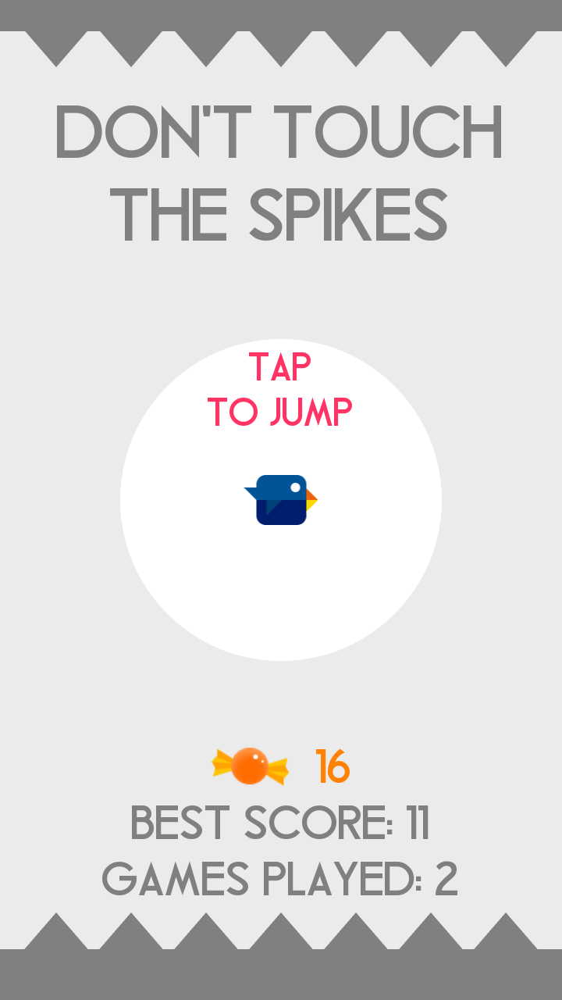
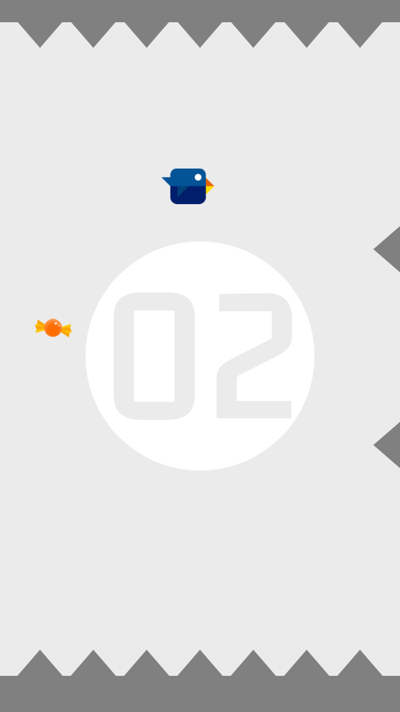
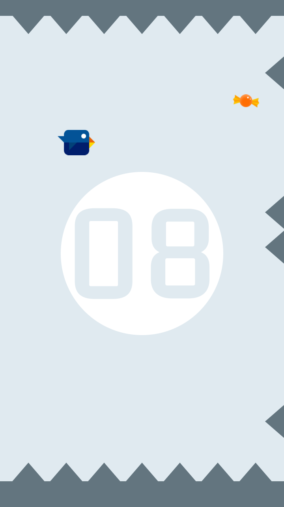
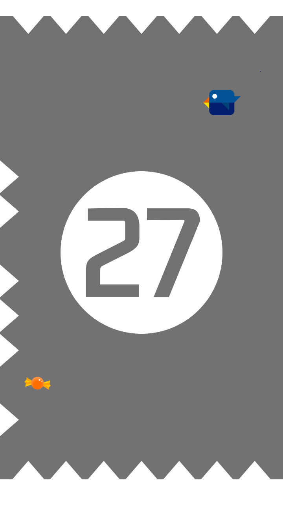
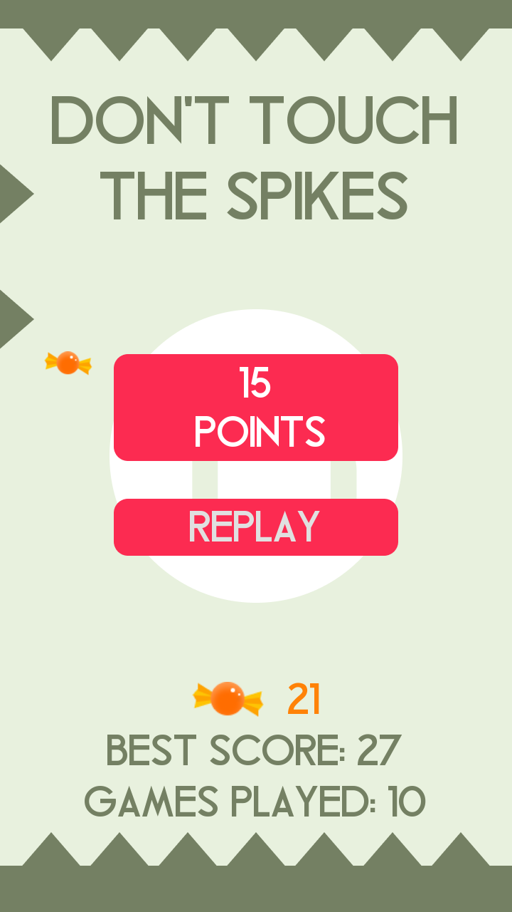

# Dont touch the spikes remade in the Godot engine
 
## Aim of this project
This is a simple project I made in a few days which I hope will help people to learn the Godot game engine.

## Contributing
Contributing or fixing my mistakes is absolutly welcomed, this project is not a full replica of the original game, it lacks many features and probably contains lots of bugs.

## Assets
All of the assets were made by me expect for the audio

Audio credits: JDSherbert

## Game Screenshots

